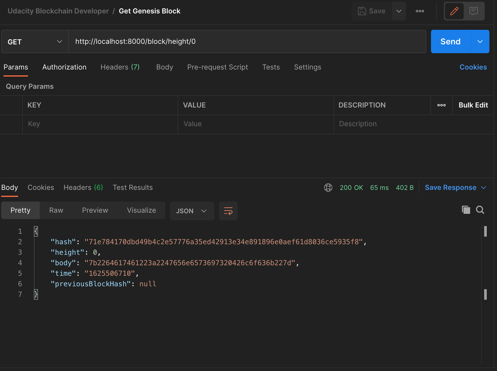
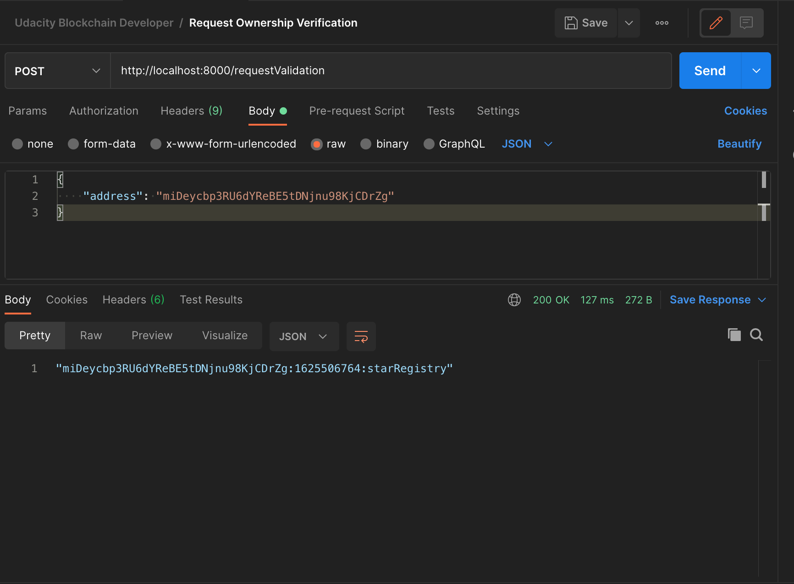
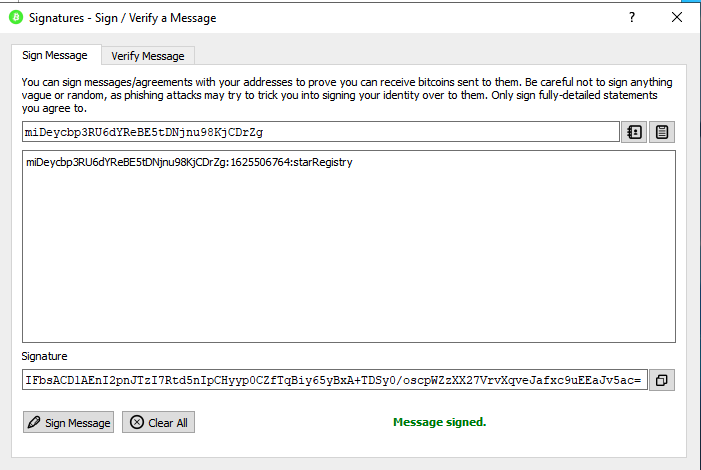
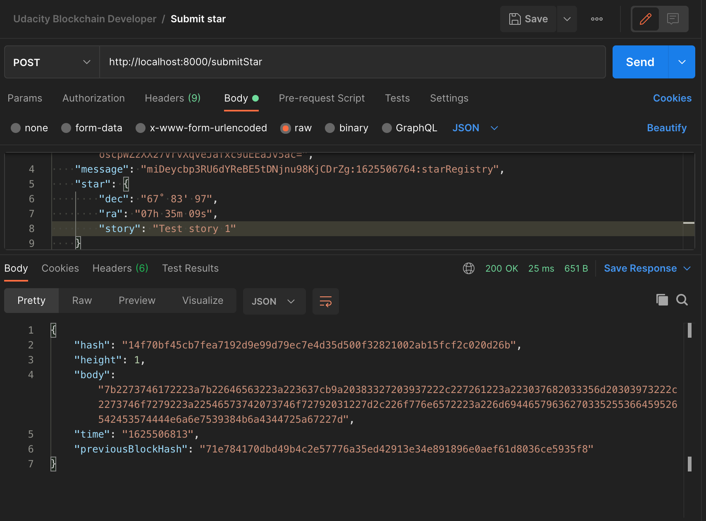
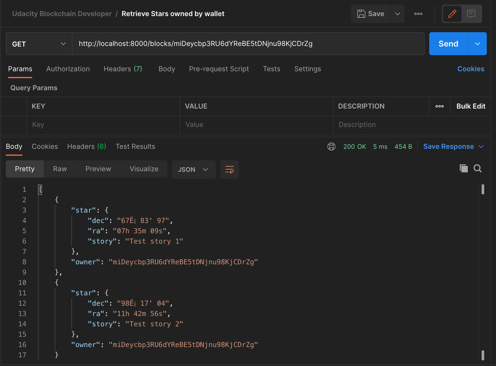

# Private Blockchain Application

This project demonstrates familiarity with the fundamental concepts of a Blockchain platform. The following concepts are demonstrated: 

- Block
- Blockchain
- Wallet
- Blockchain Identity, and
- Proof of Existance

## Problem being solved with this private Blockchain application

My employer is trying to make a test of conceptualizing how a Blockchain application can be implemented in his company. He is an astronomy fan and spends most of his free time on searching stars in the sky, which is why he would like to create a test application that will allow him to register stars, and also some of his friends can register stars too ,but making sure the application know who owned each star.

## Tools/Technologies used

- This application was created using *Node.js* and *Javascript* programming language. The architecture uses ES6 classes for code organization and to facilitate  the maintenance of the code.
- Some of the libraries or npm modules used are:
    - "*bitcoinjs-lib*": "**^4.0.3**",
    - "*bitcoinjs-message*": "**^2.0.0**",
    - "*body-parser*": "**^1.18.3**",
    - "*crypto-js*": "**^3.1.9-1**",
    - "*express*": "**^4.16.4**",
    - "*hex2ascii*": "**0.0.3**",
    - "*morgan*": "**^1.9.1**"

Purpose of the various libraries:

1. `bitcoinjs-lib` and `bitcoinjs-message`. Those libraries will help us to verify the wallet address ownership, we are going to use it to verify the signature.
2. `express` The REST Api created for the purpose of this project it is being created using Express.js framework.
3. `body-parser` this library will be used as middleware module for Express and will help us to read the json data submitted in a POST request.
4. `crypto-js` This module contain some of the most important cryotographic methods and will help us to create the block hash.
5. `hex2ascii` This library will help us to **decode** the data saved in the body of a Block.

## Running

1. Run the application from the command line/terminal:

    ```
    node app.js
    ```

2. Connect to server at `http://localhost:8000/`. You should see in your terminal a message indicating that the server is listening in port 8000:

    > Server Listening for port: 8000

## Test Results

1. Request Genesis Block:
    
2. Request ownership:
    
3. Sign message with Wallet:
    
4. Submit your Star
     
5. Retrieve Stars owned by me
    